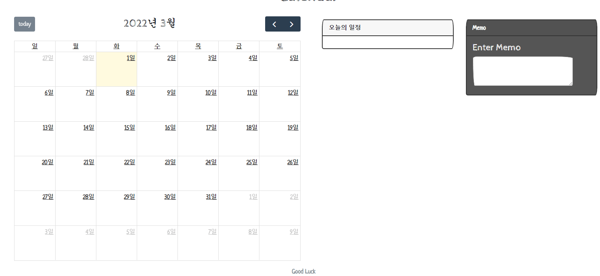
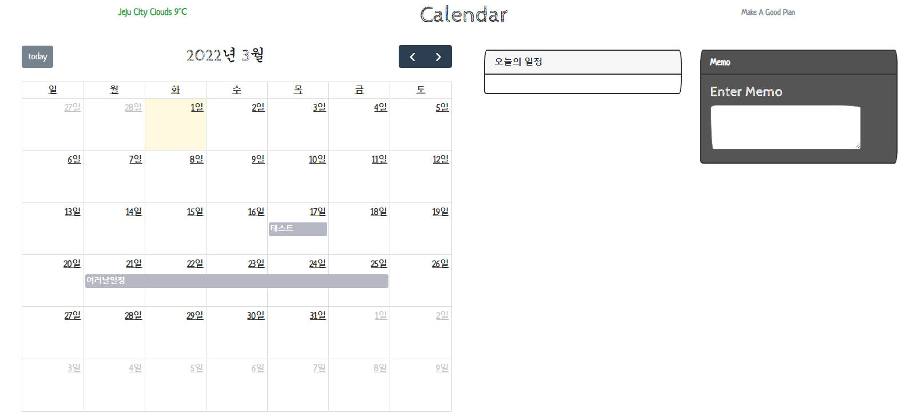
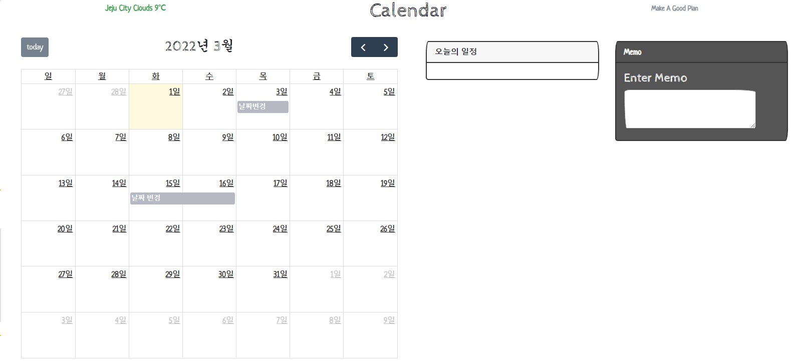

## Sandwich schedule ver 1 
>release 2022.03.01

[Link](https://yeseul-0w0.github.io/sandwich)

### 1. 사용법
1. 캘린더 사용
    1. 일정 등록  
        1. 일정을 등록하고 싶은 날을 달력에서 선택합니다.
        
        2. 우측 화면 아래에 일정 이름을 등록할 수 있는 창이 뜹니다
        
        3. 일정 이름을 등록하고 확인을 눌러주세요. (일정 등록을 원하지 않을 경우 취소를 눌러주면 됩니다.)
        
        4. 일정이 등록되어 달력에 나오게 됩니다.
        
        5. 만약 일정이 여러날에 걸처있다면, 일정이 포함된 요일을 드래그앤드롭으로 선택하세요.
        
        6. 예시
        
           
        
    2. 일정 수정
        1. 수정하고 싶은 일정을 클릭하세요.
        
        2. 우측 하단에 뜨는 일정 상세 창에서 '수정' 버튼을 누릅니다
        
        3. 원하는 방향으로 수정하고 확인 버튼을 누르세요.
        
        4. 예시
        
           
        
        5. 수정이 잘 이루어지지 않을 경우 새로고침 후 사용해보세요.
        
    3. 일정 삭제
    
        1. 삭제하고 싶은 일정을 누르세요.
    
        2. 우측 하단에 뜨는 일정 상세 창에서 '삭제' 버튼을 누릅니다
    
        3. 일정이 삭제됩니다.
    
        4. 예시
    
           
    
    4. 달력 넘기기
    
        1. 달력의 우측 상단에 있는 화살표 모양으로 월을 넘길 수 있습니다.
        2. 오늘로 돌아오고 싶다면 today를 눌러주시면 됩니다.
    
    5.  메모 
    
        1. 간단하게 내용을 정리할 수 있는 메모 기능이 있습니다.
    
            
***
***
### 2. 개발 가이드
1. node js
    1. node.js 설치 (node.js 다운로드 [페이지](https://nodejs.org/ko/download/))
    
    2. terminal 실행 → npm install → install 후 npm start → localhost로 홈페이지 실행
    
       2-1) npm start 후, dist폴더가 뜨지 않으면 terminal →  npm run build
    
    3. 서버 종료 방법 :  ctrl+c 후 y 혹은 yes 입력
  
2. Js 및 CSS 사용 법
    1. main.js에 import 해주세요.
